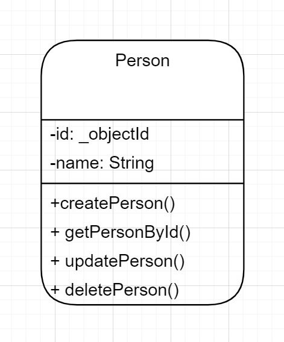

# REST API for Managing Persons
This is a simple REST API for managing persons, with support for CRUD operations (CREATE, READ, UPDATE, DELETE). It is built using Node.js, Express.js, and MongoDB. Below are instructions for setting up and using the API.

## Table of Contents
- [Prerequisites](#prerequisites)
- [Installation](#installation)
- [API Endpoints](#api_endpoints)
- [Request and Response Formats](#response_formats)
- [Sample Usage](#sample_usage)
- [Known Limitations and Assumptions](#known_limitations)
- [UML Diagram](#uml_diagram)

## Prerequisites
Before you begin, ensure you have the following:

- Node.js installed (Download and installation instructions: [Node.js](https://nodejs.org))
- Create Mongo cluster and obtain connection string/URL [MongoDB](https://www.mongodb.com/docs/atlas/getting-started/)

## Installation
1. Clone this repository to your local machine:

```bash
git clone https://github.com/IpieA/HNG-stage-two.git
cd HNG-stage-two
```
2. Install the project dependencies:
```bash
npm install
```

3. Configure the MongoDB connection:

- Create a config folder, and an .env file in your config folder and do the following:
- MONGODB_STRING = URL of your mongo database.
- PORT = 2000

4. Start the server:

```bash
npm run start
```
Your API should now be running at http://localhost:2000.

## API Endpoints

### CREATE: Adding a new person
- POST /api/
- Create a new person by sending a JSON payload with the person's details in the request body. Required fields: name, age.

### READ: Fetching details of a person
- GET /api/:id
- Retrieve a person's details by providing their unique identifier in the URL.

### UPDATE: Modifying details of an existing person
- PUT /api/:id
- Update a person's details by providing their unique identifier in the URL and sending a JSON payload with the updated details in the request body.

### DELETE: Removing a person
- DELETE /api/:id
- Delete a person by providing their unique identifier in the URL.

## Request and Response Formats

- Requests and responses are in JSON format.
- Request payloads should follow the format specified in the API documentation.
- Successful responses will have a status code of 200 OK and 201 created.
- Error responses will have appropriate status codes (e.g. 404 Not Found, 500 Internal Server Error, 422 Unprocessable Entity) along with an error message in the response body.

## Sample Usage

### CREATE: Adding a new person
- Request:

```bash
POST http://localhost:2000/api/
Content-Type: application/json

{
  "name": "Raymond Animpuye"
}
```
- Response (201 Created):

```bash
{
    "success": true,
    "person": "{
        "name": "Raymond Animpuye"
        "_id": "5f94f4f96836f407f8888888",
    }"
}
```

### READ: Fetching details of a person

- Request:
```bash
GET http://localhost:2000/api/5f94f4f96836f407f8888888
```

- Response (200 OK):

```bash
{
    "success": true,
    "person": {
        "_id": "5f94f4f96836f407f8888888",
        "name": "Raymond Animpuye"
    }
}
```

### UPDATE: Modifying details of an existing person

- Request:
```bash
PUT http://localhost:2000/api/5f94f4f96836f407f8888888
Content-Type: application/json

{
  "name": "Raymond Ipie"
}
```

- Response (200 OK):

```bash
{
    "success": true,
    "person": {
        "_id": "5f94f4f96836f407f8888888",
        "name": "Raymond Ipie",
    }
}
```

### DELETE: Removing a person

- Request:

```bash
DELETE http://localhost:2000/api/5f94f4f96836f407f8888888
Response (200 OK):
```
```bash
{
    "success": true,
    "message": "Person deleted successfully"
}
```

## Known Limitations and Assumptions

- The API assumes that the MongoDB database is running locally.
- Validation checks for input data are limited to basic checks (e.g., required fields, data types).
- Security features such as authentication and authorization are not implemented in this version.
- String and alphabetical validation is set up


## UML Diagram


- You can view the UML diagram by clicking on the provided link. This diagram represents the structure and relationships of the API's classes and models.